# Creating a 2D Platformer using Unreal Engine

## **Some prerequisites**

It is recommended you go throught getting started with unreal engine guide before doing this guide.

### **Paper ZD**

Open your epic game's launcher and head on over to Fab, which is the fourth option on the side bar 

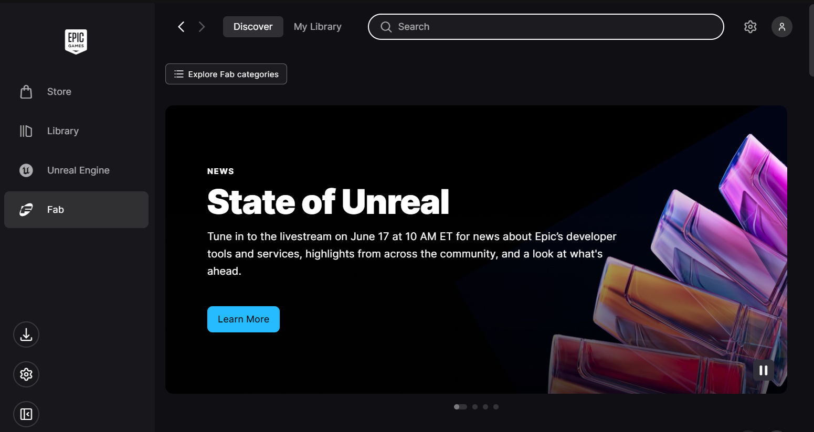

Then search for **Paper ZD** and open it up
and then click on **add to library** 
After that click on install plugin, select the engine version you are working with and that should be first thing done.

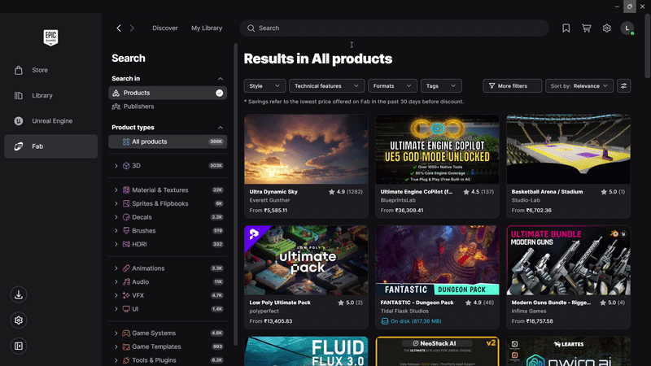

### **Installing Plugins**

Create a new project, tweak your settings as you like

Then follow the following steps to enable these two plugins,

Click on **Edit** --> **Search Paper**, and then enable **Paper2D** and **PaperZD**
Then restart the engine

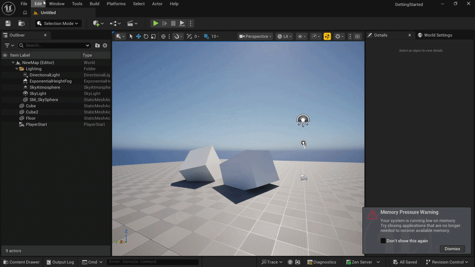

### **Recording Time**

All time recorded for unreal engine blueprints or the engine itself is to be done by using **Lapse** since unreal engine does not have native hackatime support.

You can **sync time** to **hackatime** through lapse

Check out: lapse.hackclub.com

## Getting 2D assets

A 2D game needs 2D assets, and dont we all LOVE free 2D assets.
The best website to get them are itch.io

You can click the link:
[Free 2D assets](https://itch.io/game-assets/free/tag-2d)

Although i used the following assets if you wish to follow along 1:1 with me

- **Tileset**: https://incolgames.itch.io/dungeon-platformer-tile-set-pixel-art
- **Character**: https://legnops.itch.io/red-hood-character

They are all completely free to download and play around with.

## Setting Up the Project

Although unreal engine does have a 2D template, we will learn from scratch by using an empty project.

First we will create a new map, set it as the default map for playing and opening levels. We have already discussed how to do this in the getting started guide. You can always refer back to it if you don't understand anything

Then we want to set up our project folder in the following way for ease of use

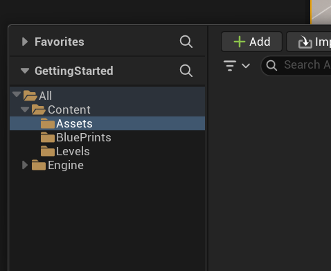

Here, 
- **Assets**: This contains all our textures, models, sprites etc.
- **Blueprints**: This contains all the blueprints you will code
- **Maps**: Self explanatory, All the maps you create will go here

## Creating Redhood

Both the RedHood Character and the dungeon level are in sprite sheets. We will discuss how to use both of them in this section

But first we have to import them and prepare them.

### **Importing and Preparing Sprites**

In the itch.io section after clicking on download, we will proceed to downloads and install the **Idle and Alter.zip** file

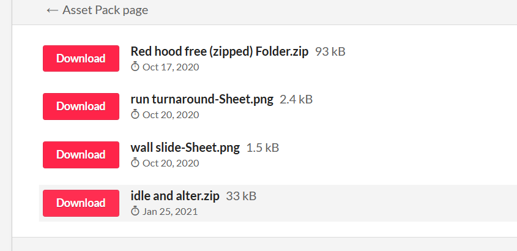

Then we will create a folder called RedHood in assets inside our project

We will extract the **Idle and Alter.zip** that and import them by opening the Content Drawer and clicking on **import**

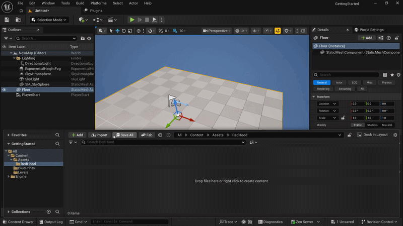

If we open any one them, we can see its pretty blurry. There's an easy way to fix that
We can just go to the **details panel** on the right

Look under **Level of Detail**

Go to **texture group** and search for **"2D Pixels (Unfiltered)"**

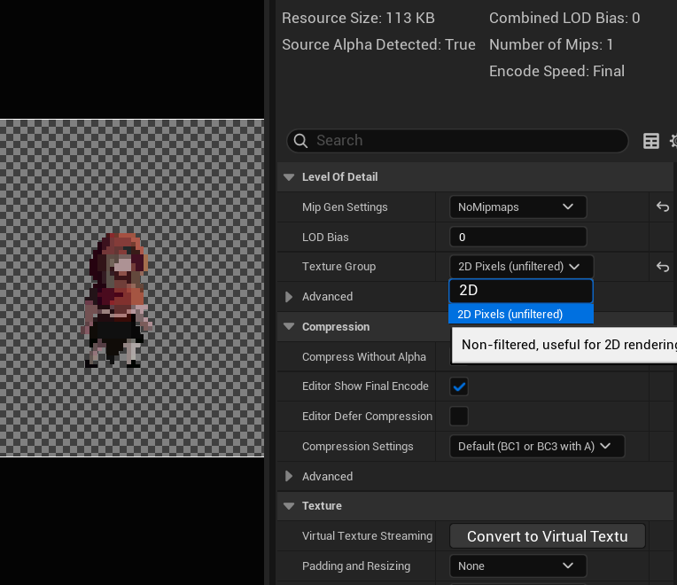

This would instantly improve the blurriness of the texture
**Press CTRL + S to save your progress**

Now to perform this action in bulk, we can select multiple texture groups by **holding SHIFT** and selecting using **Left Mouse Button**

Then Right Clicking, Going to **Asset Actions** --> **Edit Selection in Property Matrix**

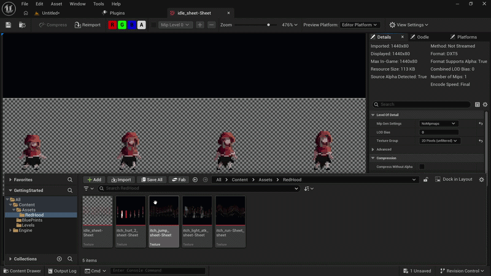

First select all the items by either selecting them by **holding shift** or pressing **CTRL + A**

Here, expand the Level of Detail drop down and change texture group from **World** to **2D Pixels** then press **CTRL + A**

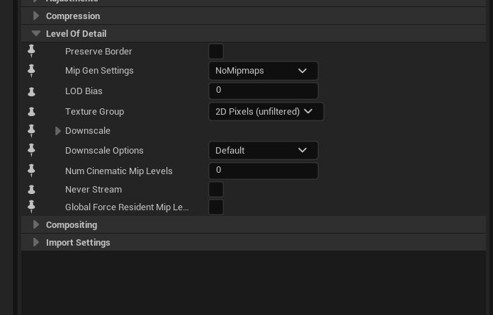

Next up what we wanna do is extract these Sheets to sprites.

Before doing that we will clean up our folder structure a little better again.

Now under RedHood we will divide the folders into 5 parts, **Idle**, **Jump**, **Run**

Here each folder represents a seperate tilemap, since we wont be covering combat in this, you can go and delete **hurt** and **light atk** if you want

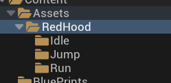

Then we can go ahead, click and drop each Texture map into its respective folder as follows

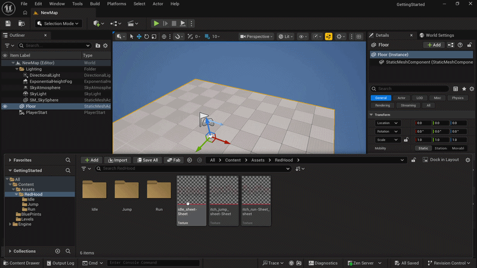

Now we can convert each of these into a sprite, this is done by right clicking a texture file, going under **sprite actions** and clicking on **extract sprites**

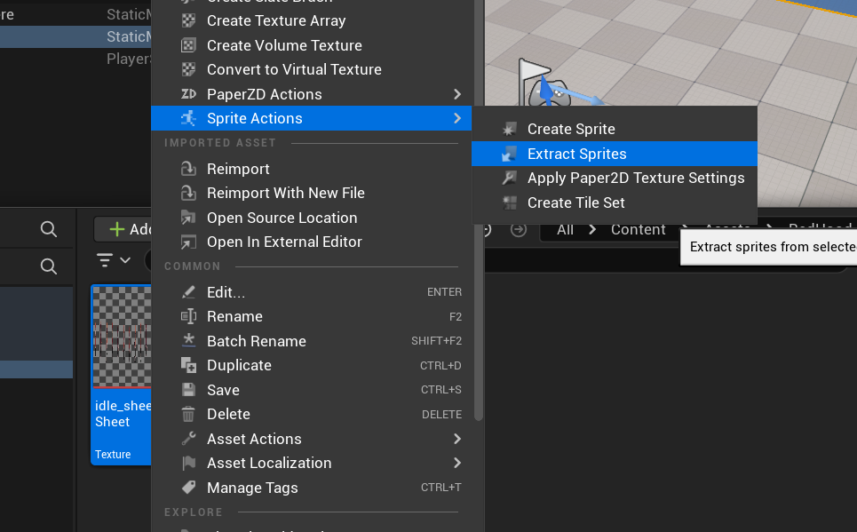

Now a window like this should pop up

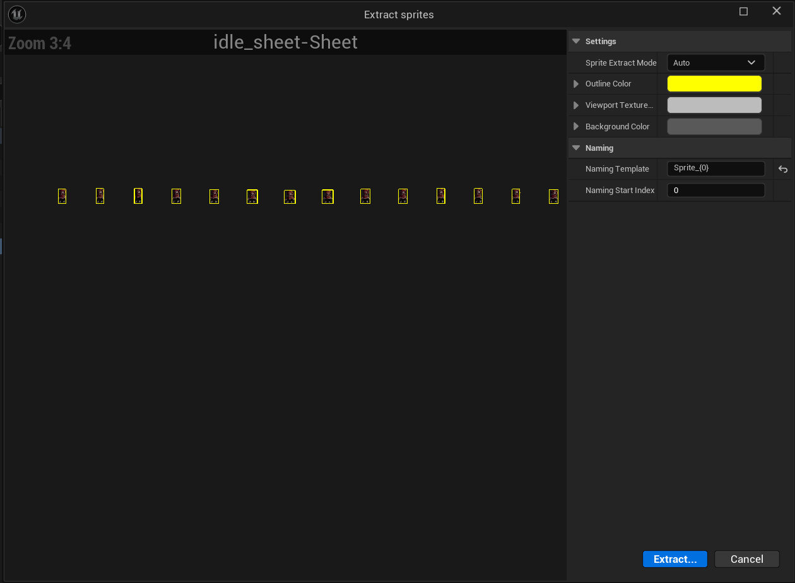

We do not want it to auto extract sprites for us because we want each sprite to be roughly the same size, to fix that you wanna go under **Sprite Extract mode** and select **Grid**

Now a seperate dropdown by the name of **Grid** should come up. 

Here we have to tweak the cell height and width. 
An easy way to get that is:

- To get cell width, count the number of items in a row and then divide it by the default length
- To get cell height divide, count the number of rows and divide it by the default height

You dont have to use a calculator, you can simply go to Cell Width enter box and just add a /(number of items you counted) infront of it

and then click extract

For eg. this is how I did it for the idle animation sheet.

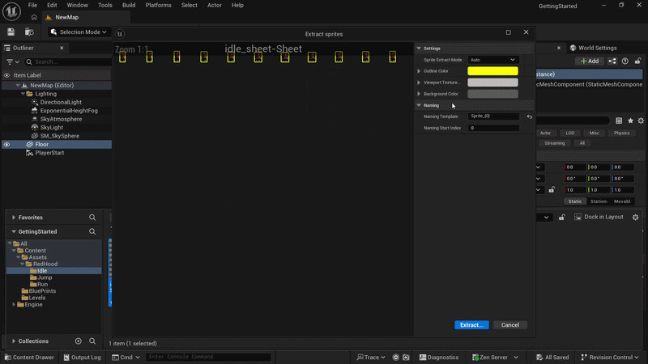

By doing this we convert a sprite sheet into individual sprites, where each sprite is a frame in the animation

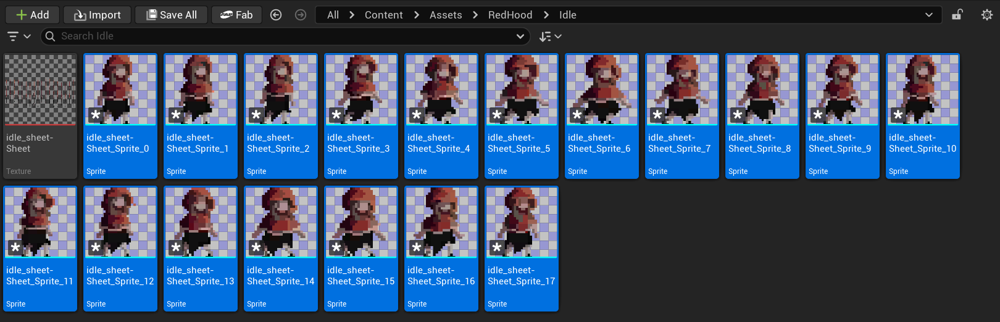
 
We want to go ahead and do this with the rest of the sprite sheets we have until we have sprites for all 3 states.

### Incase your are unable to figure out

- For idle sprite sheet, divide the width by 18
- For jump sprite sheet, divide the width by 19
- For running sprite sheet, divide the width by 24

Click on extract and lets now convert them to animations

### **Creating FlipBooks**

In Unreal Engine, a flipbook is a 2D sprite animation asset, part of the **Paper2D** plugin. It works basically like a digital flipbook/sprite sheet animation.

a sequence of sprite frames played in order to create the illusion of motion, similar to how 2D games handle animation

Before doing that let us clean up our folders structure a little as well. Open up the content **Browser** and open the **redhood** folder

Inside of **Redhood** create two folders, one called **Sprites** and the other called **FlipBooks**

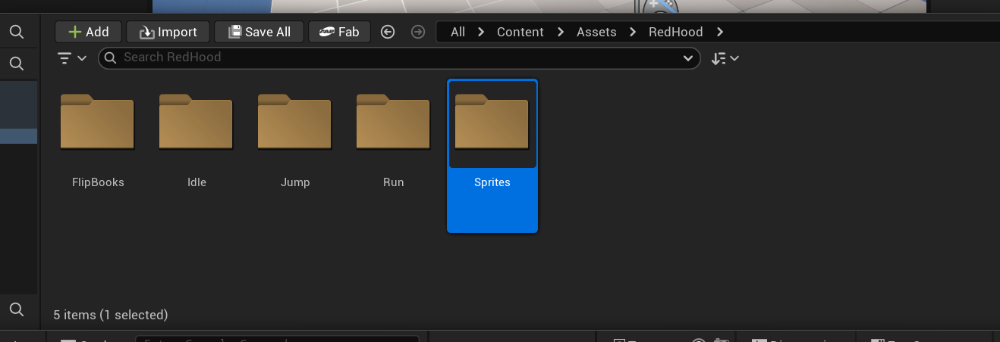

The shift the **Idle**, **Jump** and **Run** folder inside of sprites

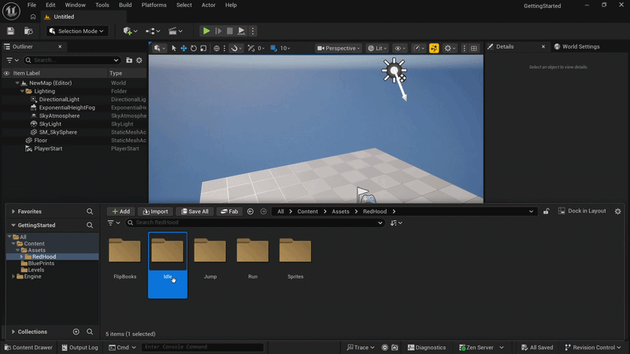

To create flipbooks let us start by going into the sprites folder and let us start with idle animation

Select all the sprites beside sprite sheet

**Right click** and select **create flipbook**

You will get a flipbook with an option to rename it. You can keep whatever you want it's name to be

Generally I prefix flipbook with **FB_**, so I named it as **FB_Idle**

(In the GIF I accidentally renamed it as running, it is the idle animation)

### In Unreal engine we generally prefix assets with a letter or two to know better what kind of asset we are using, it also makes it easier to search

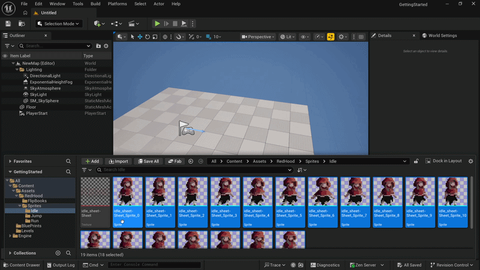

We can then drag and drop this over to our **Flipbooks folder**

Similarly we can do the exact same process with run

Go over to **run folder**, select all sprites besides sprite sheet

right click, **create flipbook**

rename it to **FB_Run**, and then move it over to the **flipbooks** folder

If the animation feels slow, dont worry about it we will fix it soon

This is what your Flipbooks folder should look like now

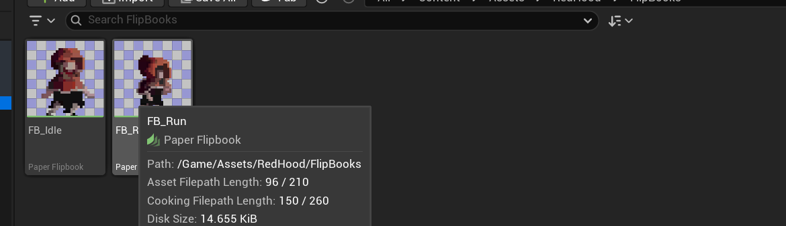

Now let us create jump animation, jump animation works a little differently.
Even tho you can do the same thing, we want to divide our jump animation into 3 seperate parts

- **Jump start**: Plays at the start of jump
- **Jump loop**: Plays while in the air
- **Jump end**: Plays when a player lands

To do this, we will first create a normal Flipbook, and open it up

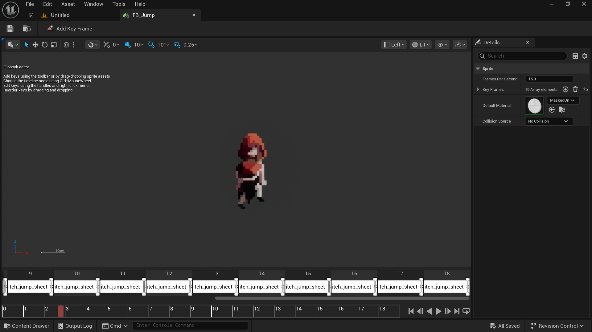

This is what a flipbook editor looks like.

here you can control how fast the animation goes, key frames, default material etc.

We will not discuss this right now but rather focus on how can we divide these animations

At the bottom we have the the **animation player**, there we can adjust the player and make out where each animation starts.

You can play around with your choice but here is what came out for me after messing around with the anim player

- **Jump Start**: Jump starts from frame 0 - 3
- **Jump Loop**: Remains from frames 4 - 14
- **Jump End**: Remains from 15 to 18

Now we will go back to our sprites player, and select frames 0 - 3

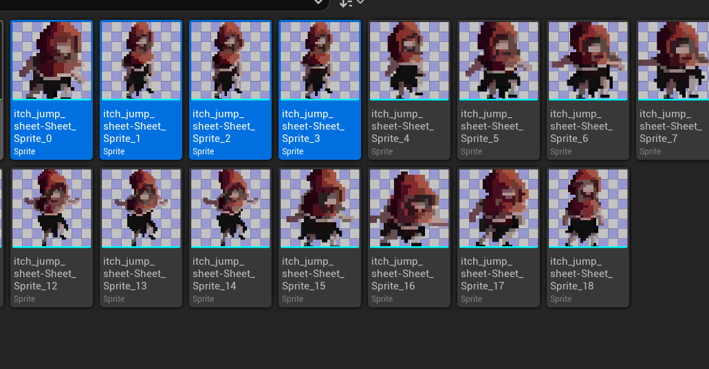

**Right Click** --> **Create FlipBook**

name it to **FB_JumpStart**

Similarly we will select frames 4 - 14

Create flipbook, rename it to **FB_JumpLoop**

and finally select frames 15 - 18

Create flipbook, rename it to **FB_JumpEnd**

Then you can delete the entire jump flipbook and migrate the three flipbooks over to the Flipbooks folder

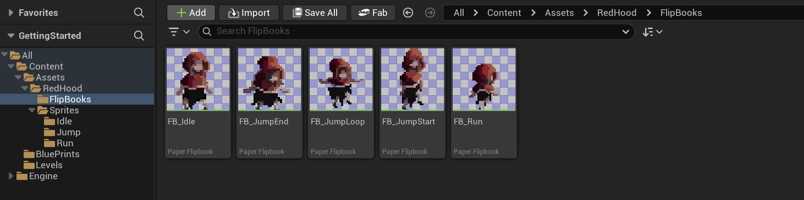

## Creating BP_RedHood

For creating a working playable character we will now jump over to BluePrints

Blueprints is unreal engine's own visual scripting language that allows you to do a lot of things
We discussed a little bit of Blueprints in the Getting Started with unreal engine guide but we will put it to real use over here

We will start off by organizing our folder structure a little bit here

Create three folders:

- **RedHood**: Will contain all blueprints related to our RedHood character
- **Input**: Will contain all inputs regarding redhood
- **Game**: Contains the game mode we will use

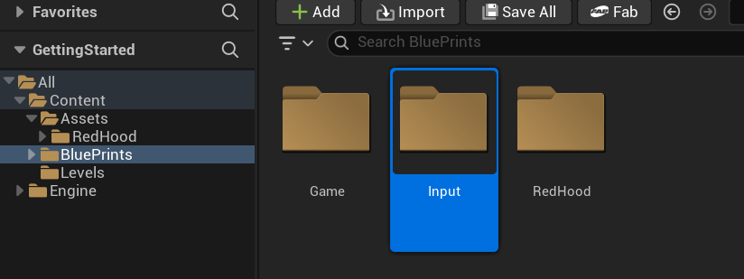

Go into **RedHood**

Right click, **Blueprint** --> **Blueprint class**

You should get a menu like this

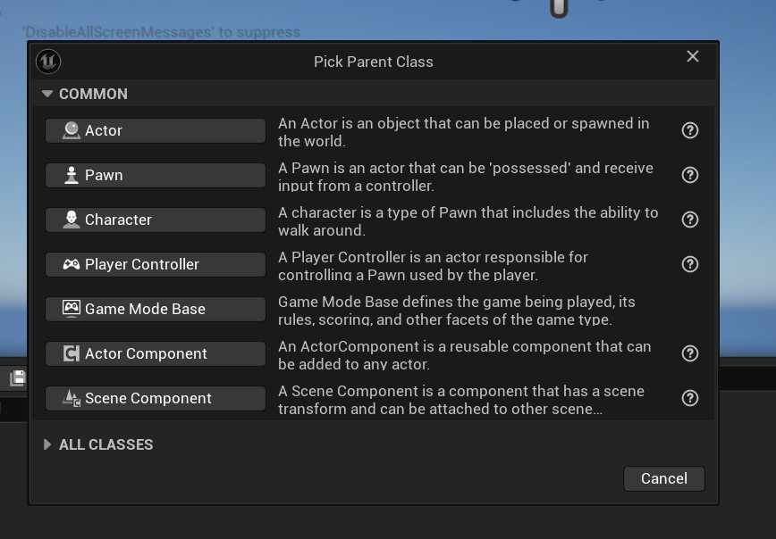

These show a bunch of common blueprints but we are not going to work with either of these.

Select the drop down **All Classes** and search for PaperZDCharacter, hit select

Rename the Blueprint to BP_RedHood

This is what will open up

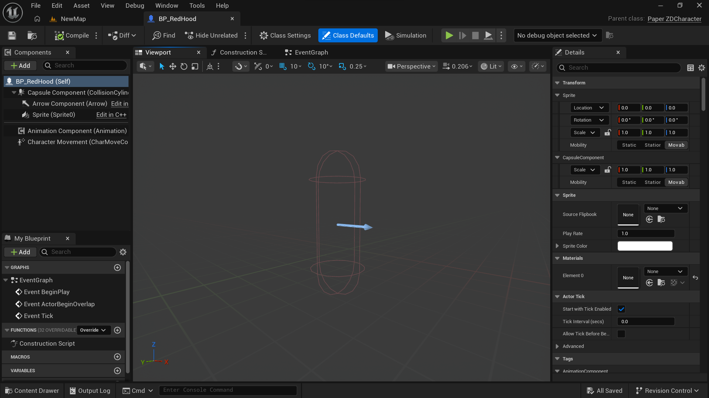

Since there are a lot of aspects in a blueprint character, I will tell you the important things only

On the left are **components tab**, these are all the components your character has.

- **Capsule component** is the bounds for your character.
- **Sprite** Is where the sprite for your character goes, it takes sprite and flipbooks
- **Animation Component** Handles animation for our character
- **Character Movement** Handles movement for our character

On the details panel we can start by adding the idle flipbook by clicking sprite, going down to Sprite, clicking Source Flipbook and choosing any animation of your choice

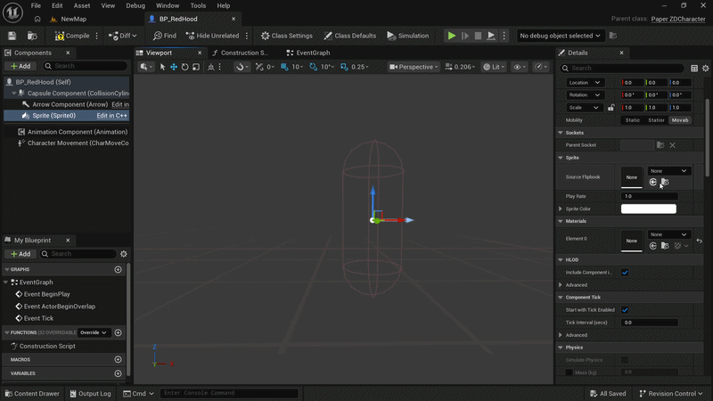

### A small fix

Here we can see that our sprite is too small, we can rescale the capsule but that messes up our collisions.
To fix that we will scale up our sprites.

Here's how to do it

go back to **Assets** --> **Redhood** --> **Sprites**

click on the filter button

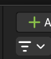

Search for sprite and select it

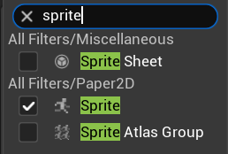

Select all by pressing **CTRL + A**

**Right click** --> **Asset Actions** --> **Bulk Edit in property Matrix**

Go under **sprite dropdown**,

here we want to edit the pixels per unit, meaning how many pixels per an unreal unit should the sprite show

Over here we can edit it to be 0.25 and then save all by pressing **CTRL + S**

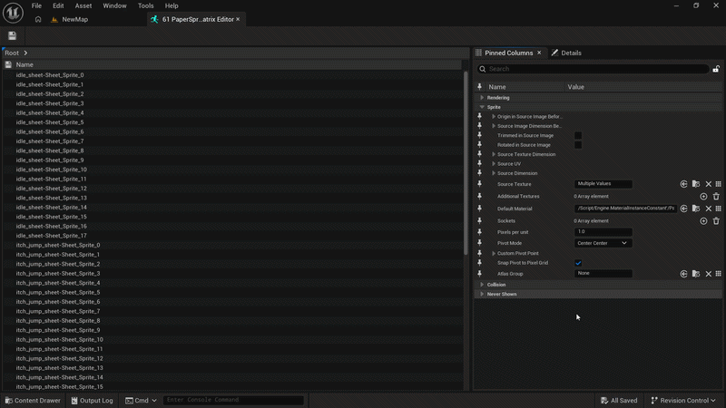

Then we can go out, right click on the and press remove all filters

and if we go back into BP_RedHood, we can see the sprite is big enough

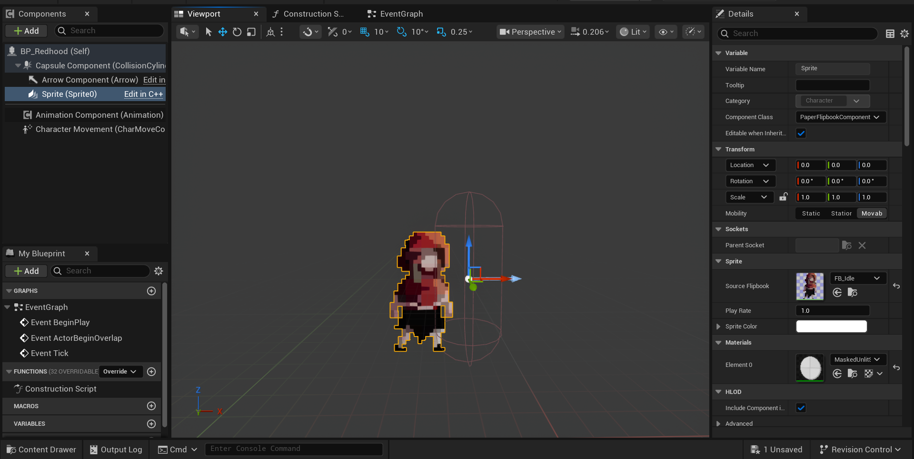

Click on sprite and add the following to the location

- x = 48
- y = 0
- z = 11

Click on the **capsule**,

search for **half height** and set it to 62

### **Camera Settings**

Next up we will set up our camera

Go to our **Components**, click on add and add **spring arm**

Then we will click on spring arm and add a **camera**

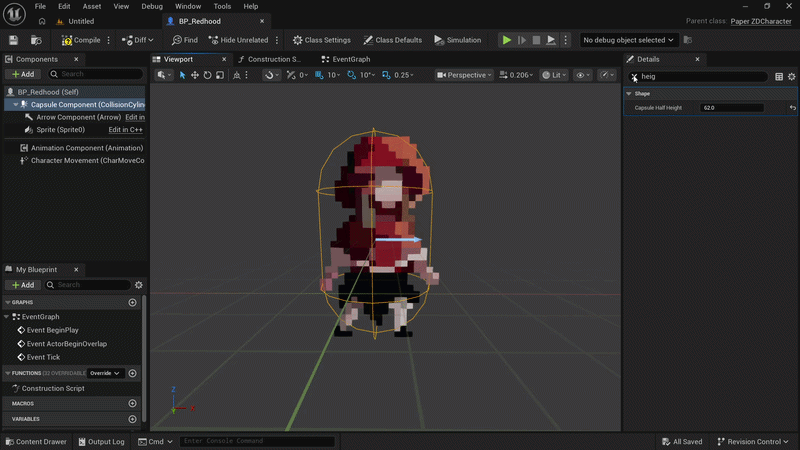

Select the **spring arm**, go to its rotation and set the Z axis to -90

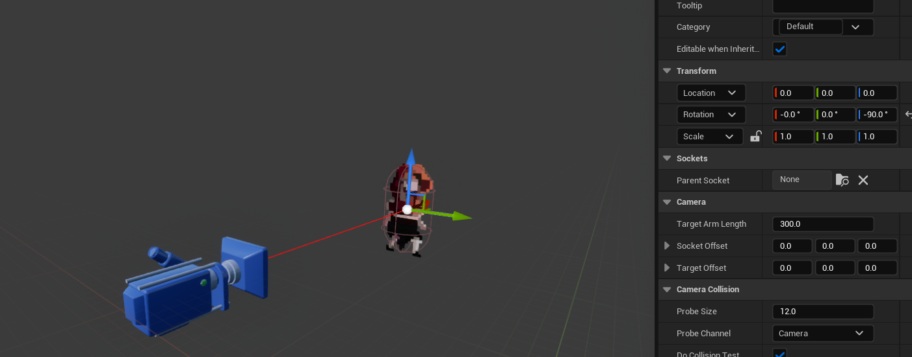

This would cause the camera to look in front directly at the player

### **Adding Game Mode**

Go to the **Game** folder we created inside of Blueprints

**Right Click** --> **Blueprint Class** --> **GameModeBase**

Rename it to **BP_GameMode**

Open it, go over to the details panel, open Default Pawn Class, Search for BP_RedHood and select it

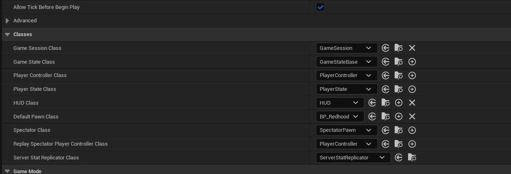

Hit **CTRL + S** and exit

Next go to Edit --> Project Settings --> Maps & Modes --> Select default game mode as the BP_GameMode

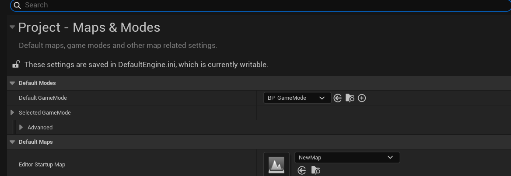

If we hit play we will possess our BP_RedHood Class

Now we can't move around because we have no input set up, we will do this in the next section

### **Setting up input for the Character**

Unreal Engine uses an **Enhanced Input** system, which separates *what triggers an action* (a key/button) from *what the action does* (Blueprint logic). This makes it easy to remap controls later without touching your character logic.

Go to the **Input** folder we created earlier.

First create a new folder called **Input Actions**

**Right click** --> **Input** --> **Input Action**

Create two of these:

- **IA_Move**
- **IA_Jump**

For **IA_Move**, open it up and under **Value Type** select **Axis1D (Float)** since we only need left/right movement on a 2D plane

For **IA_Jump**, leave the **Value Type** as **Digital (bool)**

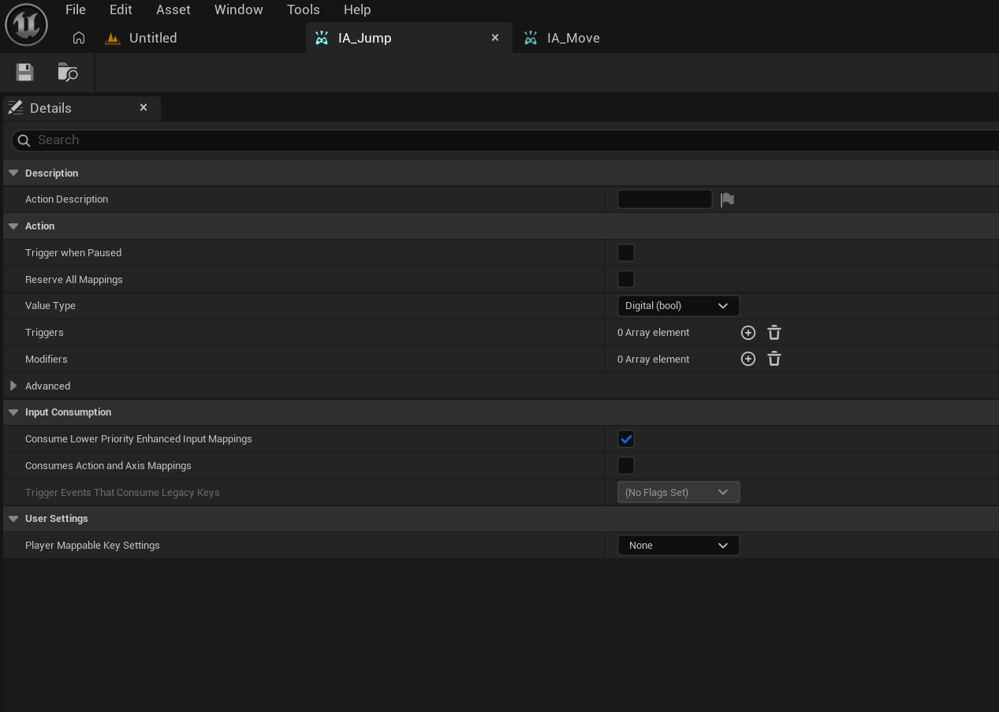
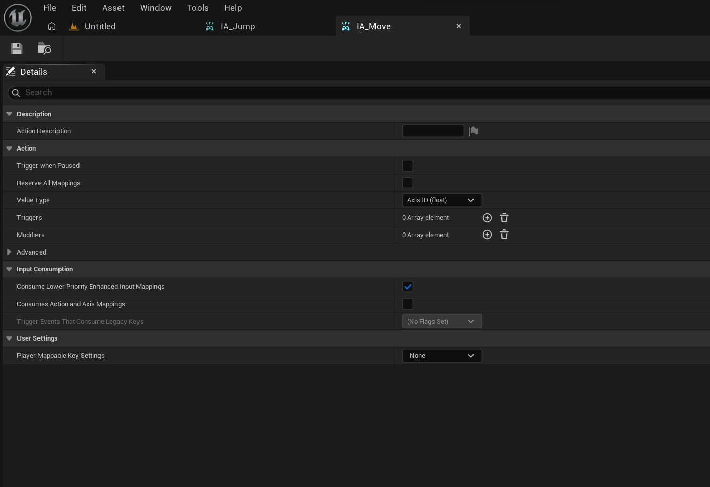

press **CTRL + SHIFT + S** to save your progress

Next, **right click** --> **Input** --> **Input Mapping Context**

Name it **IMC_RxedHood**

Open it up and add both **IA_Move** and **IA_Jump**

- For **IA_Move**, add two bindings: **A** and **D** (or **Left** and **Right** arrow keys). Set **A** to **Negate** under the modifiers so pressing it gives -1
- For **IA_Jump**, bind it to **Space Bar**

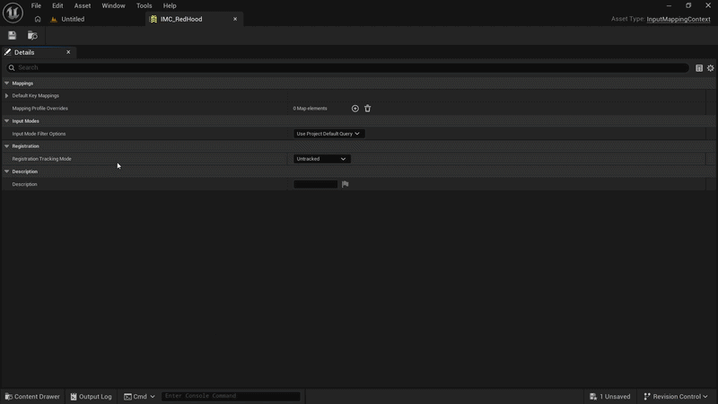

### **Adding the Mapping Context**

Open **BP_RedHood**, go to the **Event Graph**

On **Event BeginPlay**, First seperately add **Get player controller**, Drag off the pin and add **Cast to PlayerController**.

From as Player Controller, search for **Enhanced Input Local Player Subsystem**. 

From that drag out and search for **add input mapping**, in **Mapping Context** search for IMC RedHood

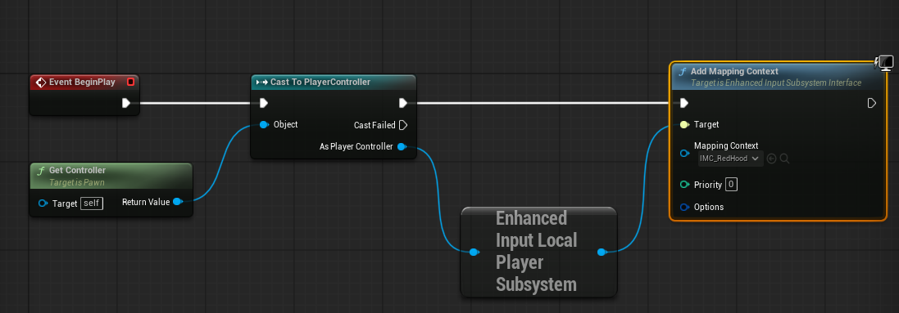

We can select all the nodes, Right Click, Collapse to Function and rename it to "**Get mapping Context**"

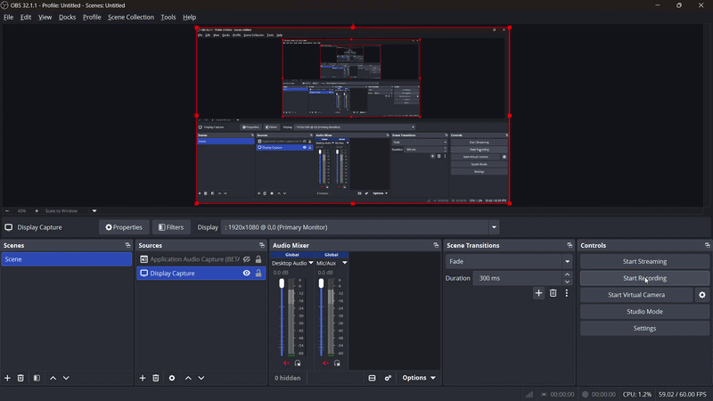

### **Handling Movement**

Still in the **Event Graph**, right click and add an **Enhanced Input Action IA_Move** node

From the **Triggered** pin, drag off the **Action Value** (Axis1D float) and plug it into **Add Movement Input**

For **Add Movement Input** you'll need:
- **World Direction**: Get **Actor Forward Vector** (since we're in 2D, this will just move along X)
- **Scale Value**: plug in the Axis1D value from IA_Move

Set **World Direction** in Add Movement input to 1 in the **X Axis**

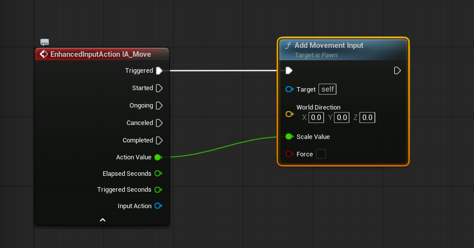

Since RedHood only has animations facing one direction, we need to flip the sprite when moving the opposite way.

Off the same **Action Value** from IA_Move, plug it into a **Branch** (using a >= 0 check)

- If **true** (moving right), set the **Sprite's Relative Rotation** Yaw to **0**
- If **false** (moving left), set the **Sprite's Relative Rotation** Yaw to **180**

We will create a new function by going to the functions tab and pressing +

Rename the function to **RotateController**

From our character movement component, we will get current acceleration. On the yellow pin, we will right click and **select split struc** pin. This divides our output from a single vector to 3 floats

We will drag out of the RotateController pin and search for **Compare float**, we will drag **Return Value X** into the **input** and leave **compare with** to 0

Then we will right click, search for **Get Controller**, and out of the **Return Value**, we will search for **Set control rotation**

we will copy and paste this below it and drag pins from both > and < into their respective pins 

On the < pin we will set **New Rotation Z** to 180

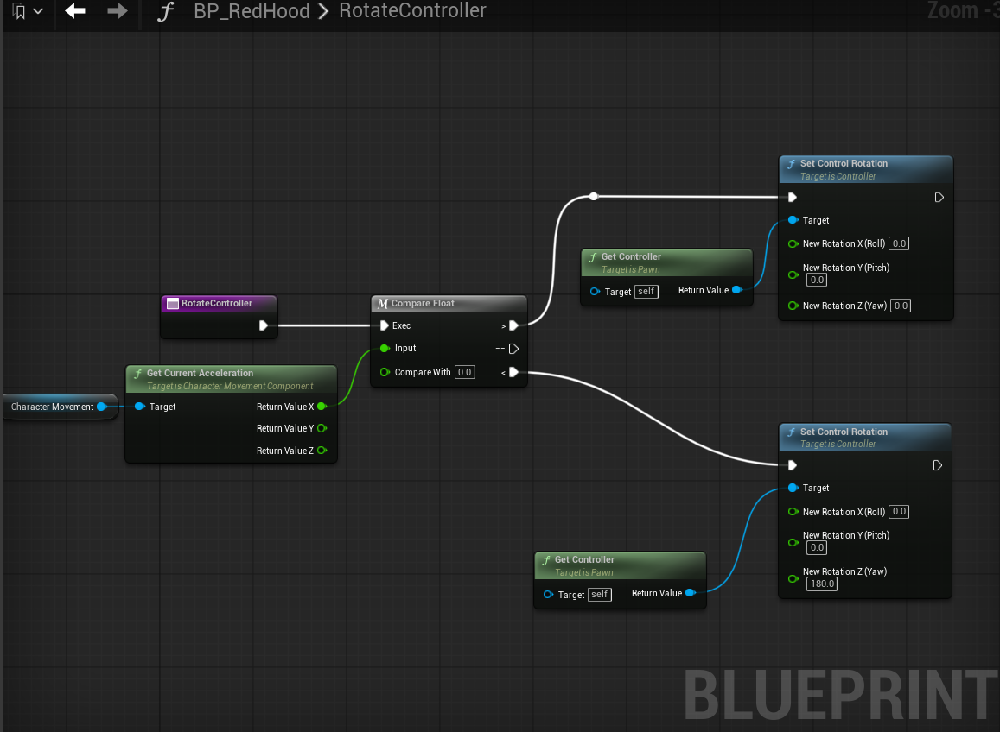

Select **Spring Arm**, Go under Camera settings and disable **Inherit Pitch, Yaw and Roll**

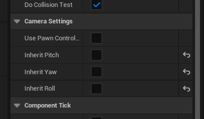

We will close the window for the given function and go out to the main window where we will connect this IA_MOVE

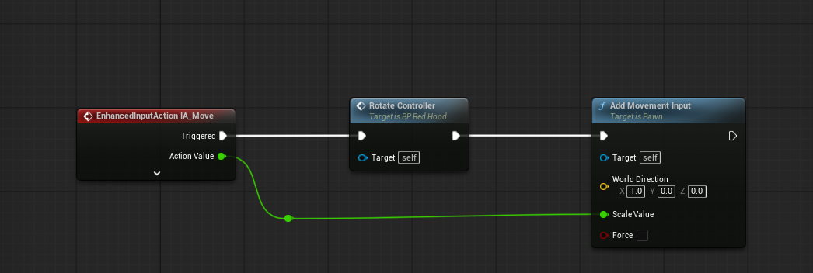

### **Handling Jump**

Add an **Enhanced Input Action IA_Jump** node

Off the **Triggered** pin, call the **Jump** function (this is a built-in Character function)

Off the **Completed** pin (released), call **Stop Jumping**

Hit **Play**, and you should now be able to move left/right and jump with your character flipping appropriately

**Press CTRL + S to save everything**

## Creating the Animation Blueprint

Now that movement works, we want our flipbooks to actually play depending on what the character is doing. This is where **PaperZD's Animation Blueprint** comes in.

Go back to your **RedHood** Blueprints folder

**Right click** --> **PaperZD** --> **Animation Blueprint**

Select **BP_RedHood** as the parent class when prompted

Rename it to **AS_Redhood** as we prefix Animation Source with **AS_**

Open it up. You'll see a layout similar to a normal Animation Blueprint, but built for 2D flipbooks instead of skeletal animations.

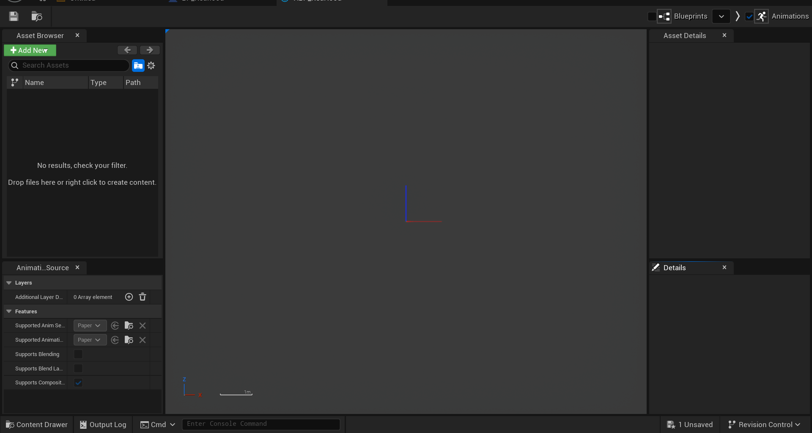

Click **Add New** and then **New Animation Sequence**

This allows a person to add a flipbook to animation.

name it accordingly, go to the details on the right and under animation select any FlipBook

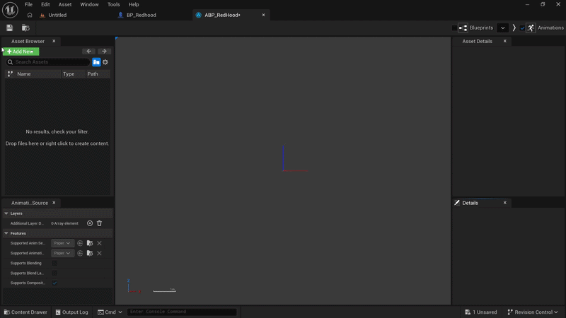

Go ahead and do this for all flipbooks we have created

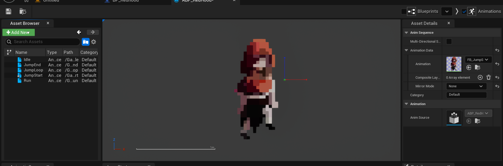

### **ANOTHER SMALL FIX**

Our run animation felt too slow, to fix that go over to our **run flip book**,

Go over to frames per second, and set it to 33

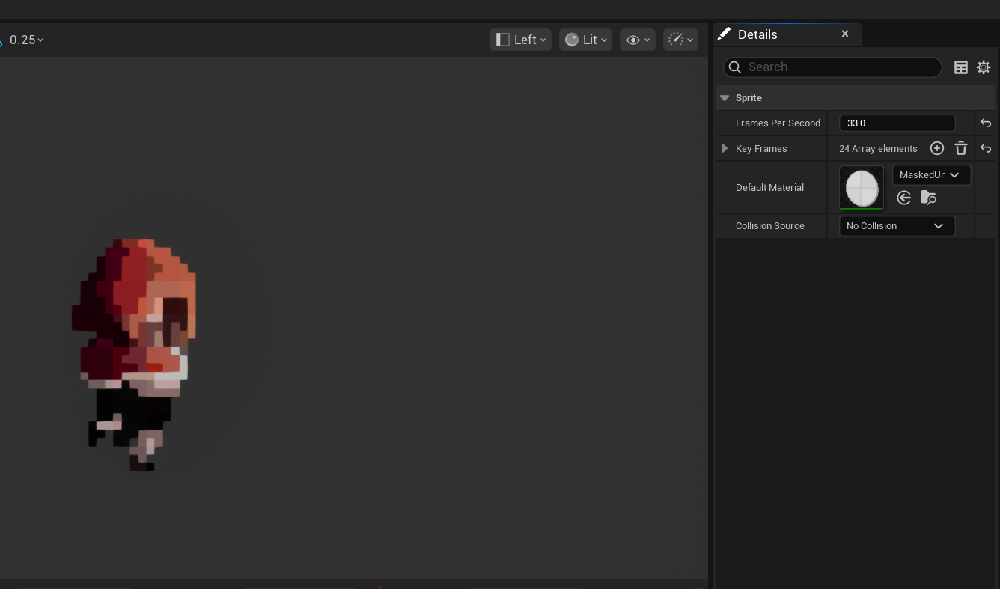

### **CREATING ANIM BLUEPRINT**

Right click in our Redhood folder and search for PaperZD animation

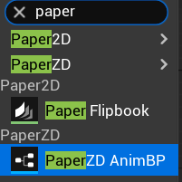

In the selection window select AS_RedHood and name the Animation Blueprint to ABP_RedHood

There we will see 2 graphs, Anim Graph and Event Graph.

- **Anim Graph**: Where we manage our animations
- **Event Graph**: Where we manage all the logic

We can hook in any Animation Blueprint to our Anim Graph Result by searching for it.

First we will add it to BP_RedHood tho,

Go back to BP_RedHood, Select Animation Component and go down to PaperZD.

There under **Anim Instance Class** select ABP_RedHood

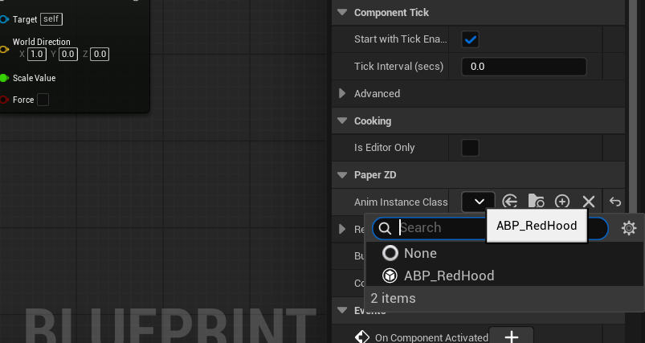

Go back to Event Graph for ABP_Redhood

below **Event OnIt** get **Get owning actor**

From the return value, drag out and **cast to BP_Character** and drag out from as Character and promote to variable

Then from Character, drag out and get **Character Movement** and promote that to variable

Connect all to **execution pins** to **Event OnIt**

Select all and collapse to function called **Store Important Variables**

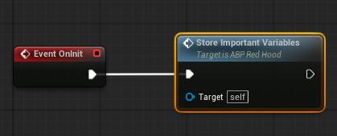

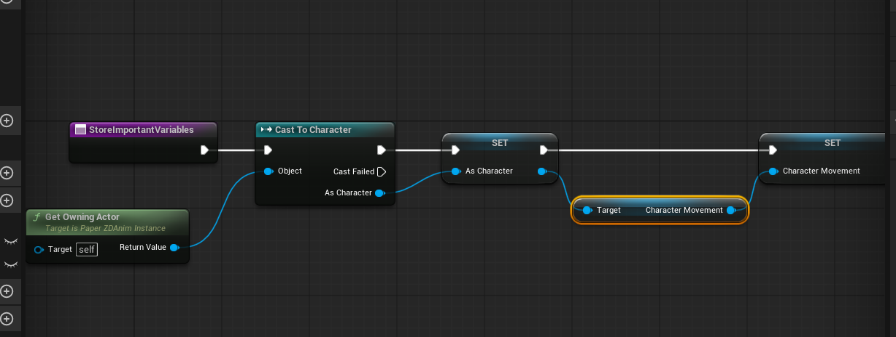

In **event tick**, we will drag out our **Character** Variable, right click and **convert to validated get**

We will then create three checks,

First create a variable called **IsMoving** and set it to a **Boolean**

Then create a variable **IsFalling** as a **Boolean**

Drag out of **Is Valid** and add a **Sequence** node by searching for it

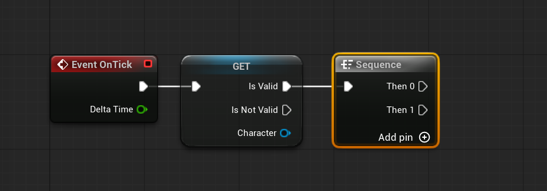

After that we will create sequences to check whether we are in air or not

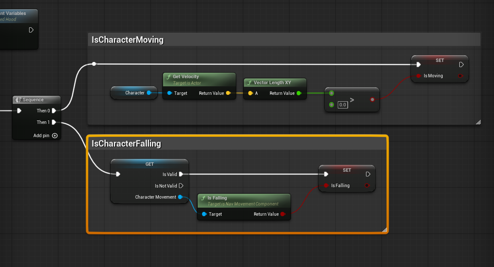

### SOME NOTES

- To comment we use the **C Key**
- To Straighten Wires we use the **Q KEY**

Then we can head back into **AnimGraph**, Right click and search for **New State Machine**

Name it **Locomotion** and **double click**, hook it into result and double click to open

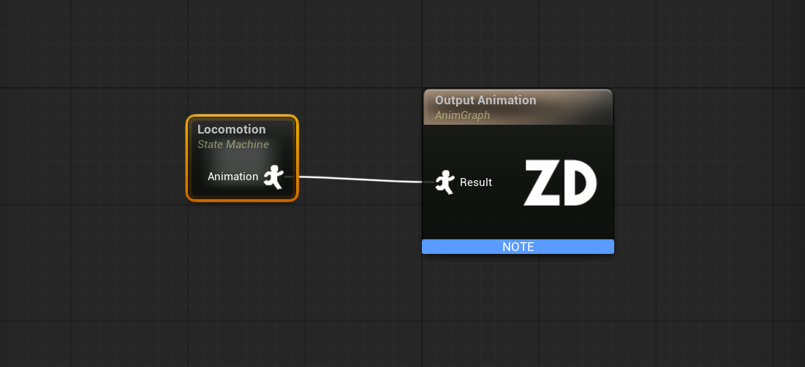

Drag out the out and add a new state, rename it on the details panel to Idle

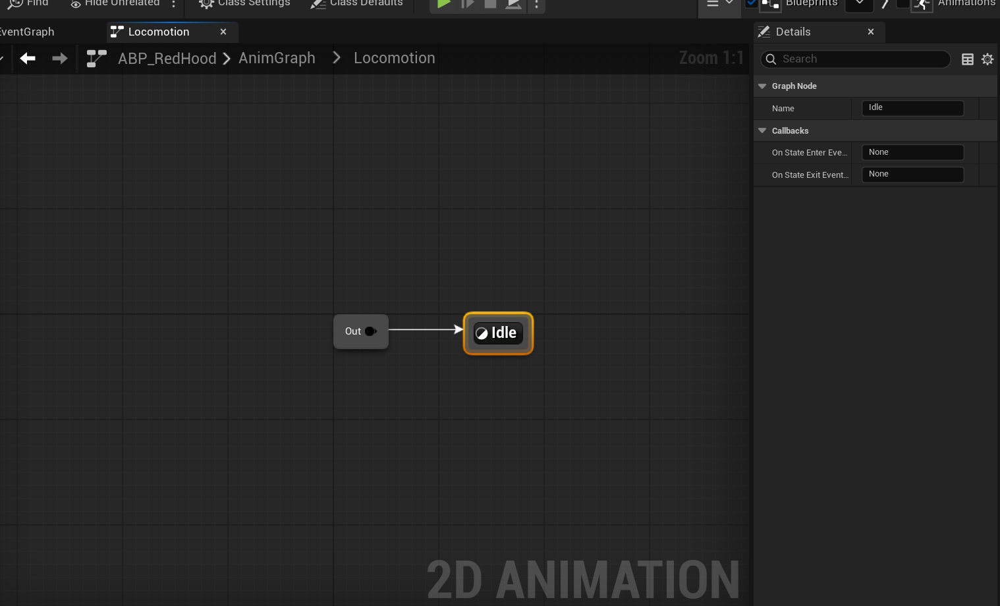

Go inside by double clicking

**Right click** --> Search for **Play Idle** --> Connect to Result

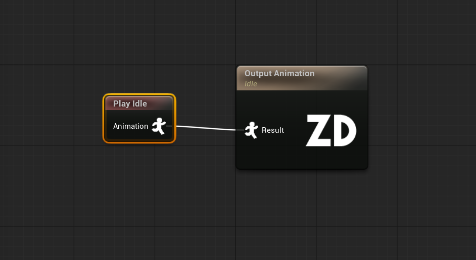

We can go back out by clicking the **back key** on the top or **clicking on locomotion**

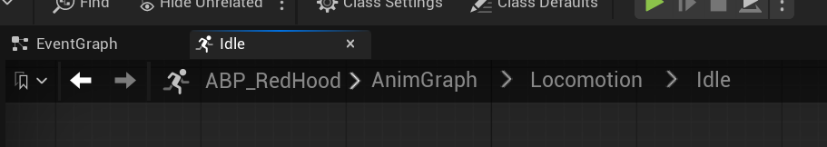

Similarly we will drag out of Idle, create new state called running, go inside, attach Play Running to it 

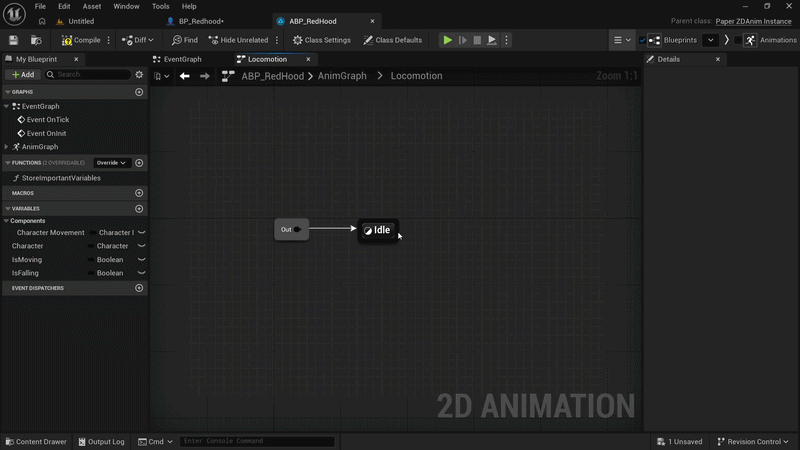

After going back out we can see a sort of logo has popped up, that is called a **transition rule**

we can double click on it and open this window

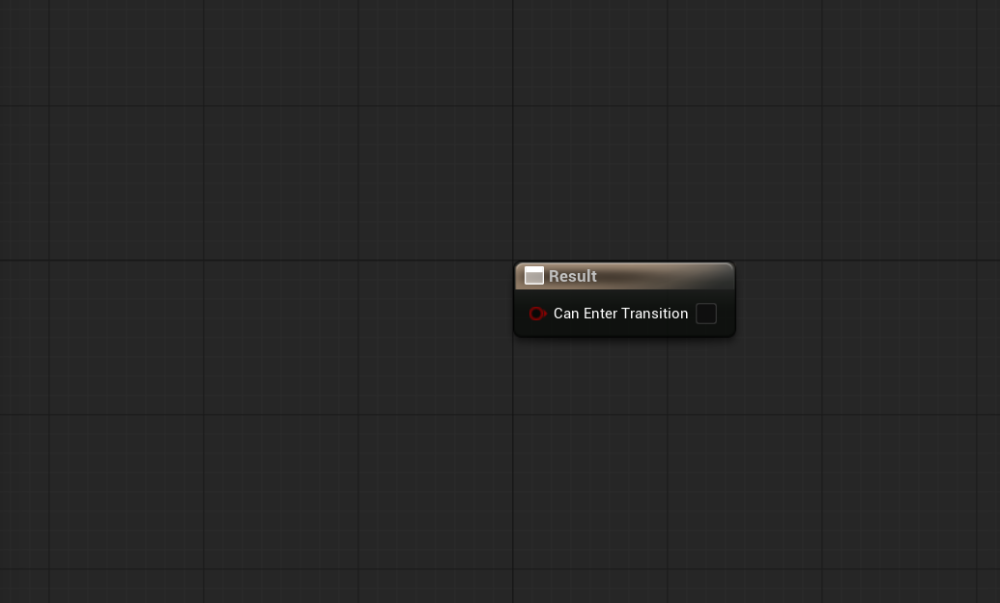

Here we can right click, search for **isMoving** and plug that into **can enter transition**

Before playtesting, we have to go back out to locomotion, drag off running and back into idle so that.

That creates another transition rule, open it

after that get **is moving**, drag off and search for **Not Boolean**, connect the not boolean to can enter transition

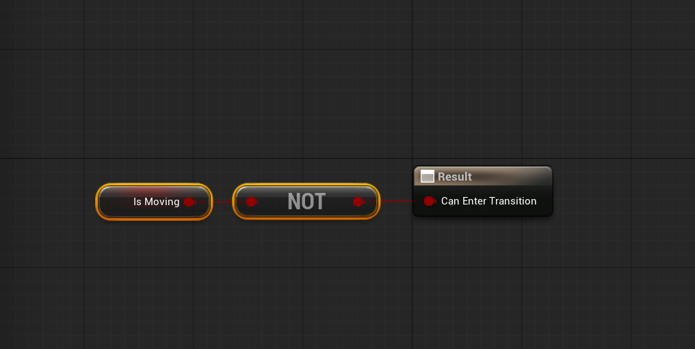

Now if we play test we can see our character animated better as it plays idle animation when idle and moves when moving

However we still are unable to completely jump. We will handle that in the next section

### Jumping

jumping is a real doozy as we have many more variables to work with

## Wrapping Up

At this point you have:

- A fully imported and sliced 2D character with idle, run, and three-part jump flipbooks
- A working Blueprint character using Enhanced Input for movement and jumping, with a custom rotation-based flip rather than a simple branch
- An Animation Blueprint with a state machine that properly sequences JumpStart --> JumpLoop --> JumpEnd based on movement state and landing

From here, you can expand on this foundation by adding combat (using the hurt/light attack sprites we skipped earlier), parallax backgrounds, checkpoints, or enemy AI using the same PaperZD workflow.

If you have any questions feel free to reach out on Slack @Lemong

With love from lemong <3