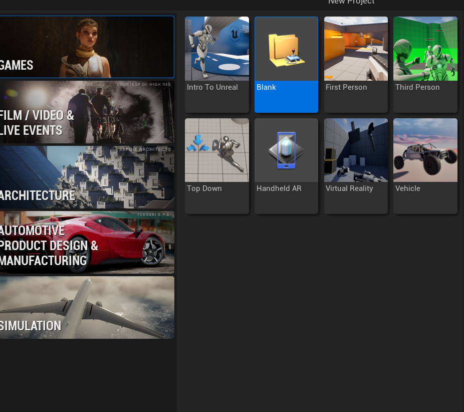
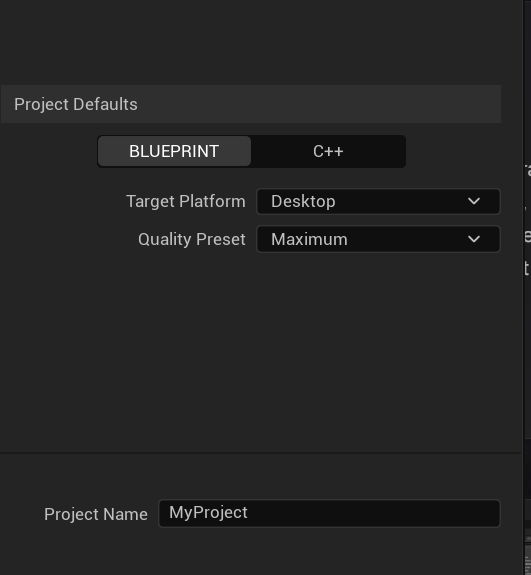

# Getting Started with Unreal Engine
 
## Installation
 
Download the Epic Games Launcher from [unrealengine.com](https://www.unrealengine.com) and create a free Epic Games account. Once inside the launcher, go to the Unreal Engine tab, click Library, and hit the + button to add the latest UE5 version. The download is roughly 25–35 GB.
 
## Creating Your First Project
 
1. Open the Epic Games Launcher and click **Launch**.
2. The Unreal Project Browser will open. Choose a template (Blank, Third Person, First Person, etc).

3. Set your project to **Blueprint** (easier for beginners) or **C++**.
4. Choose a project name and folder.

5. Click **Create**.
